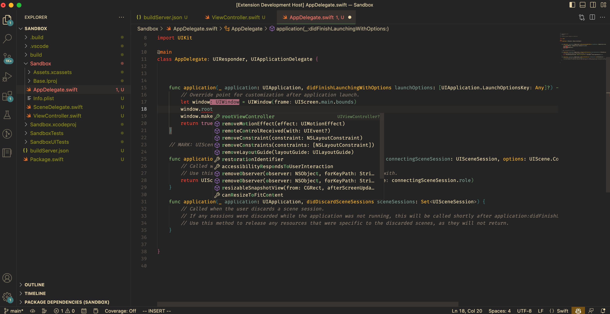

# xcode-build-server
Build Server Protocol implementation to serve completions using sourcekit-lsp in projects like .xcodeproj and .xcworkspace.

Inspired by [xcode-build-server](https://github.com/SolaWing/xcode-build-server), but this repository is implemented in swift.

## Installation
### Manual
```bash
git clone https://github.com/k-ymmt/xcode-build-server.git
cd xcode-build-server
swift build -c release
```

## Usage
1. Create buildServer.json in the directory containing .xcodeproj and .xcworkspace

e.g.)
```json
{
  "name": "xcode build server", 
  "version": "0.1", 
  "bspVersion": "2.0", 
  "languages": ["c", "cpp", "objective-c", "objective-cpp", "swift"], 
  "argv": ["path/to/xcode-build-server/.build/debug/xcode-build-server"], 
  "scheme": "Your scheme"
}
```

2. Open your editor

e.g. vscode
1. Create Empty Package.swift in the directory
2. Open the directory by vscode
3. Install extension [vscode-swift](https://github.com/swift-server/vscode-swift)
4. Wait few minutes...

## Notes
This repository is still under development, and there are many bugs.
Please report issues if you find them.
PR is always welcome.